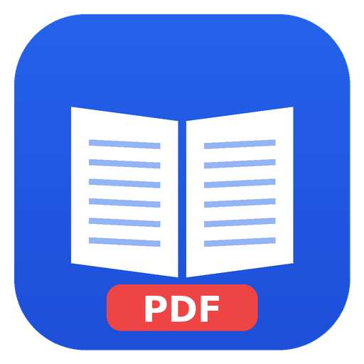

# EPUBtoPDF

EPUB 전자책을 원하는 조판으로 PDF로 만드는 Windows 11용 데스크톱 앱입니다.
용지 크기, 여백, 글꼴, 글자 크기, 줄 간격, **쪽당 줄 수**를 정하고, 결과를 앱 안에서 바로 미리 보며 고칠 수 있습니다.
변환은 모두 앱 안에서 이루어지며 인터넷이나 다른 프로그램이 필요 없습니다.



## 설치

[Releases](https://github.com/leopold0106/EPUBtoPDF/releases) 또는 GitHub Actions 실행 결과의 `EPUBtoPDF-windows` 결과물에서 받습니다.

- `EPUBtoPDF-Setup-<버전>.exe` — 설치형 (시작 메뉴·바탕화면 바로 가기, `.epub` 파일 연결)
- `EPUBtoPDF-Portable-<버전>.exe` — 설치 없이 바로 실행

코드 서명을 하지 않았기 때문에 처음 실행할 때 "Windows의 PC 보호" 경고가 뜰 수 있습니다. **추가 정보 → 실행**을 누르면 됩니다.

## 사용법

1. **EPUB 열기** — 단추를 누르거나, 창에 파일을 끌어다 놓거나, 탐색기에서 `.epub`을 더블클릭합니다.
2. **설정** — 왼쪽 패널에서 바꾸면 오른쪽 미리보기가 곧바로 다시 그려집니다.
3. **PDF로 변환** — 저장 위치를 고르면 끝입니다. 기본 저장 위치는 EPUB과 같은 폴더입니다.

### 설정

| 묶음 | 내용 |
|---|---|
| 용지 | A4, A5(국판), A6(문고판), B5, B6, 신국판, 4×6판, 4×6배판, 크라운판, US Letter, 사용자 지정(mm) · 가로/세로 |
| 여백 | 위·아래·안쪽·바깥쪽(mm). **양면 인쇄**를 켜면 짝수 쪽의 좌우 여백을 뒤집습니다 |
| 글꼴 | 설치된 글꼴 목록에서 고르거나 **글꼴 파일(TTF·OTF·TTC·WOFF)을 추가**해 쓸 수 있습니다. 추가한 글꼴은 이 앱에서만 쓰이며 PDF에 포함됩니다 |
| 본문 | **글자 크기 지정** 또는 **쪽당 줄 수 지정**(글자 크기를 자동 계산, 줄 간격 배수는 유지) · 줄 간격 · 문단 간격 · 제목 위아래 간격 · 첫 줄 들여쓰기 · 정렬 · 글자/어절 단위 줄 바꿈 · 줄 격자 맞춤 |
| 원본 스타일 | **유지**: 표·강조·그림 배치 등 원본 모양은 살리고 글꼴·크기·줄 간격·여백만 바꿉니다. 시나 가운데 정렬 문단처럼 본문과 다른 문단은 원래 모양을 지킵니다. **무시**: 원본 스타일을 버리고 설정만으로 짭니다 (제목과 문단 사이를 한 줄씩 띄움) |
| 쪽 번호·머리글 | 쪽 번호 위치(아래 가운데, 아래·위 바깥쪽) · 머리글(책 제목, 장 제목) |
| PDF | EPUB 목차를 PDF 책갈피로 넣기 |

설정 위의 요약에서 계산된 글자 크기, 쪽당 줄 수, 한 줄 글자 수를 볼 수 있고, 여백이 너무 크거나 글자가 지나치게 작아지면 알려 줍니다.
설정은 자동으로 저장되어 다음에 앱을 열 때 그대로 쓰입니다.

**줄 격자 맞춤**을 켜면 제목·그림·표·인용 뒤에도 본문 줄이 늘 같은 높이에 오도록 맞춰, 모든 쪽의 줄 위치와 줄 수가 일정해집니다 (표 안의 글자는 제외).

### 프리셋

설정 맨 위에서 고릅니다. 기본 프리셋: 소설·국판(A5), 소설·신국판, 문고판(A6), 쪽당 20줄·A5, 교재·B5, 큰 글씨·A4, 화면으로 읽기.
지금 설정을 **내 프리셋으로 저장**하거나 파일(`.epubtopdf.json`)로 **내보내기·가져오기**해 다른 사람과 주고받을 수 있습니다.

### 미리보기

- 장을 하나씩 보거나 **책 전체**를 볼 수 있고, 펼침면(책 모양)으로 보거나 확대·축소할 수 있습니다.
- 위쪽에 이 장의 쪽수, 책 전체 쪽수, 미리보기에서 실제로 잰 쪽당 최대 줄 수가 나옵니다.

### 그림 빼기

- 미리보기에서 그림을 눌러 고른 뒤 **Delete** (또는 오른쪽 단추 → 이 그림 빼기)
- **Ctrl+Z** 되돌리기, **Ctrl+Y** 다시 하기
- **그림** 탭에서 장별 썸네일을 보고 하나씩 빼거나 **모두 빼기**
- 캡션이 딸린 그림은 캡션까지 함께 빠지고, 그림을 빼서 비게 된 쪽(표지 등)은 남지 않습니다. 원본 EPUB은 바뀌지 않습니다.

### 알아 둘 점

- DRM(복제 방지)이 걸린 EPUB은 변환할 수 없습니다.
- 장 제목 머리글을 쓰면 장마다 새 쪽에서 시작합니다.
- 책 안의 스크립트는 실행하지 않고, 책이 인터넷 주소의 그림·글꼴을 불러오려 해도 막습니다.

## 명령줄 변환

창을 띄우지 않고 변환할 수도 있습니다. 설정 파일은 앱 설정이나 내보낸 프리셋과 같은 JSON 형식이며, 빠진 항목은 기본값을 씁니다.
편집 파일로 뺄 그림을 정할 수 있습니다 (예: `{"hiddenImages": ["0:0"]}` — `장 위치:장 안의 그림 순서`, 0부터).

```bash
EPUBtoPDF --convert 책.epub [--out 책.pdf] [--settings 설정.json] [--edits 편집.json]
# 개발 중에는: npx electron . --convert 책.epub
```

종료 코드: 0 성공, 1 변환 실패(EPUB을 열 수 없음 등), 2 잘못된 인자나 설정.

## 개발

Node.js 22.12 이상이 필요합니다. Linux/macOS에서도 개발할 수 있으며, Windows 설치 파일은 GitHub Actions에서도 만들어집니다.

```bash
npm ci            # 의존성 설치 (package-lock.json 기준)
npm run dev       # 개발 모드로 실행
npm run typecheck # 타입 검사
npm test          # 단위 테스트
npm run test:e2e  # 앱을 빌드해 실제로 변환하고 화면을 조작하는 테스트 (Linux: xvfb-run -a npm run test:e2e)
npm run sample    # 시험용 샘플 EPUB 만들기 (samples/강가의-기록.epub)
npm run build:win # Windows 설치 파일 (dist/)
```

`main` 브랜치에 푸시하거나 PR을 열면 GitHub Actions가 Ubuntu와 Windows에서 테스트하고 설치 파일을 만들어 결과물로 올립니다.
화면 테스트의 스크린샷도 `gui-screenshots-windows` 결과물로 올라갑니다. `v*` 태그를 푸시하면 Release에 설치 파일이 붙습니다.

### 구조

```
src/
  main/      Electron 메인 프로세스
    epub/      EPUB 파싱, epub:// 프로토콜
    render/    렌더링 창, PDF 인쇄, 책갈피 후처리
    fonts/     사용자 글꼴(app-font://), 글꼴 파일 정보 읽기
  preload/   앱 창과 렌더링 창의 preload
  render/    렌더링 창 안: 장 문서 조립(assemble), 본문 문단 판별·글자 크기 비율·줄 격자 맞춤(typeset)
  renderer/  React 화면 (설정, 미리보기, 그림, 프리셋)
  shared/    설정, 조판 계산, CSS 생성, 프리셋 등 공용 코드
tests/       단위 테스트 (fixtures/: 테스트용 EPUB·글꼴 생성기, e2e/: 실제 변환·화면 테스트)
scripts/     개발용 스크립트
build/       앱 아이콘
```

변환 방식: 숨겨진 Chromium 창에서 모든 장을 하나의 문서로 조립하고, 설정을 CSS(`@page`, 이름 붙은 쪽, 앵커 위치 등)로 바꿔 넣은 뒤 Chromium의 PDF 인쇄로 만듭니다.
미리보기도 같은 경로로 만들기 때문에 미리보기와 결과가 같습니다.
